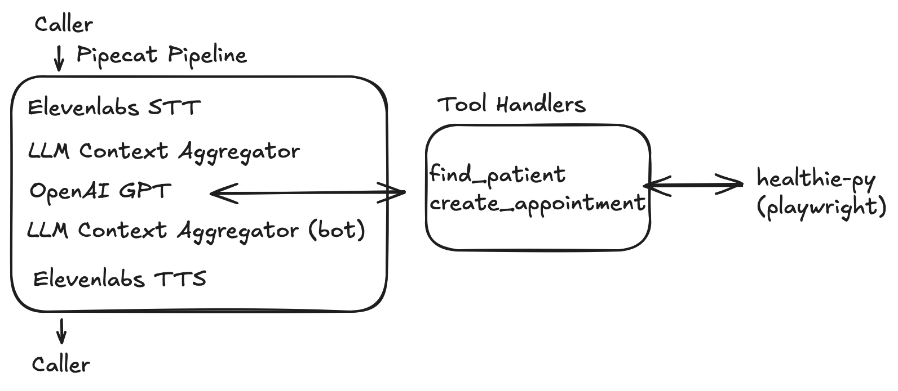

# Solution Overview

## Architecture

### Key Components

| Component       | Provider                             | Function                                                  |
| --------------- | ------------------------------------ | --------------------------------------------------------- |
| Voice pipeline  | Pipecat                              | Manages STT → LLM → TTS pipeline, VAD, and turn detection |
| STT             | ElevenLabs                           | Low-latency streaming transcription                       |
| LLM             | OpenAI                               | Question answering and reliable function calling          |
| TTS             | ElevenLabs                           | Text-to-speech generation                                 |
| Turn detection  | LocalSmartTurnAnalyzerV3 + SileroVAD | Prevents the bot from interrupting the caller             |
| EHR integration | Playwright                           | Navigates and scrapes the Healthie UI                     |

---

# Implementation Decisions

## Conversation Flow

The conversation flow is designed to be simple, accurate, and natural.

1. **Greet** — introduce the bot as a Prosper Health assistant
2. **Collect name** — ask for the caller’s full name. Ask them to repeat or spell it if unclear.
3. **Collect DOB** — ask for the date of birth and confirm it.
4. **Find patient** — call `find_patient`. Handle `no_results_for_name`, `dob_mismatch`, and `system_error` with retry logic.
5. **Collect appointment date** — ask for the preferred date.
6. **Collect appointment time** — ask for the preferred time.
7. **Book appointment** — call `create_appointment`. Handle `unavailable_time_slot`, `invalid_date`, and `system_error`.
8. **Confirm** — repeat the final appointment details.

The prompt enforces **one question at a time** and instructs the LLM **not to expose internal error codes or patient IDs**. Retry limits are also defined.

Clear step definitions reduce hallucinations and unexpected conversation changes.

---

## Healthie Tools

The functions `find_patient` and `create_appointment` interact with Healthie using **Playwright**. This approach was kept from the base implementation, although it is not ideal for latency or reliability.

Main behaviors:

* **Parameter processing** — standardize parameters received from the LLM and convert them to the format used by the Healthie UI.
* **UI navigation** — use Playwright to navigate the Healthie interface.
* **Return schema** — return structured results that clearly describe success or failure.
* **Error handling** — handle format errors, navigation errors, and system errors.
* **Monitoring** — add logs to track internal states during testing.

The return schema is important because the LLM uses this information to decide how to continue the conversation.

---

## Integration

Pipecat supports tool integration through two schemas:

* **`FunctionSchema`** — defines a single tool
* **`ToolsSchema`** — groups several tools and passes them to the LLM through `LLMContext`

A `FunctionSchema` is defined for each Healthie operation:

* `find_patient`
* `create_appointment`

At runtime, tool calls are handled by **tool call handlers** such as:

* `handle_find_patient`
* `handle_create_appointment`

These handlers receive the tool request from the LLM and call the corresponding functions in `healthie.py`.

During testing, the handlers were configured with:

`cancel_on_interruption=False`

This prevents tool calls from being cancelled when the user interrupts.

---

# Latency

## Session Reuse / API

Logging into Healthie for every tool call adds **10–20 seconds** of delay.

**Solution:** reuse the browser session and log in only when the session expires.

A better long-term solution is to **replace Playwright with the Healthie API**, which would simplify the system and reduce latency.

### Main latency sources

| Source                      | Estimate | Mitigation                                      |
| --------------------------- | -------- | ----------------------------------------------- |
| Playwright login            | 10–20s   | Session reuse or API                            |
| Playwright page interaction | 2–4s     | Difficult to avoid with scraping; API is better |
| OpenAI response             | ~2s      | Reduce context size                             |
| ElevenLabs STT              | ~500ms   | Use a faster model                              |
| ElevenLabs TTS              | ~175ms   | Use a faster model                              |

Currently, the main bottleneck is the **Healthie UI interaction**.

With session reuse, tool calls would take **2–4 seconds**, which is acceptable for a phone call.

Replacing Playwright with the **Healthie API or webhooks** could reduce tool latency to **under 500 ms**.

---

# Reliability

### Healthie UI Changes

Selectors are hardcoded, so UI changes may break the automation.

**Mitigation:** run a daily CI smoke test that calls `find_patient` and `create_appointment` on a test patient.

---

### OpenAI Unavailability

There is no fallback LLM.

**Mitigation:** add a secondary provider such as Anthropic Claude or a local model via Ollama.

---

### ElevenLabs Unavailability

There is no fallback for STT or TTS.

**Mitigation:** Pipecat supports alternatives such as **Deepgram (STT)** and **Cartesia (TTS)**.

---

### Strict Matching

Patient matching is deterministic because the Healthie search field is limited.

A better approach would be:

1. Retrieve all clients
2. Apply fuzzy name matching
3. Select the closest match above a similarity threshold
4. Verify the date of birth
5. Ask the caller to confirm the name

This approach would reduce errors caused by speech recognition mistakes and improve user experience.

---

# Evaluation

To verify the system works correctly, three levels of testing can be used.

---

## Unit Tests — `healthie.py`

Test `find_patient` and `create_appointment` separately in a Healthie staging environment.

Verify correct outputs for all cases:

* `success=True`
* `no_results_for_name`
* `dob_mismatch`
* `system_error`
* `unavailable_time_slot`
* `invalid_date`

---

## Conversation Flow Tests

Use the Pipecat test runner or a mock transport to simulate calls and verify that the LLM calls the correct tools with the correct arguments.

Key scenarios:

* **Happy path** — valid name → valid DOB → available slot → confirmed
* **Name not found** — retry up to 2 times
* **DOB mismatch** — ask again and retry
* **Slot unavailable** — offer another time
* **Invalid date** - ask again and retry
* **System error** — retry up to 2 times

---

## End-to-End Call Simulation

Create synthetic phone calls (for example using ElevenLabs) and run them through the full system pipeline.

Evaluate:

* Was the appointment created in Healthie?
* Did the bot confirm the correct details?
* Was the total call duration acceptable?

A simple dashboard can track these metrics for each call.
